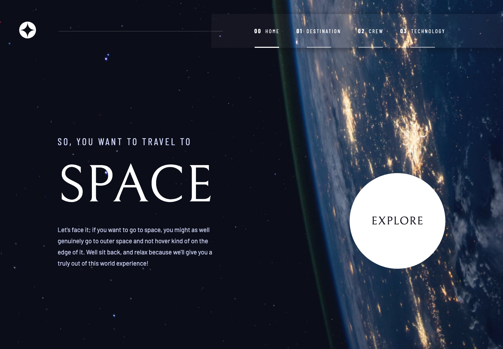

# Space Tourism Website Solution

This is a solution to the [Space tourism website challenge on Frontend Mentor](https://www.frontendmentor.io/challenges/space-tourism-multipage-website-gRWj1URZ3). Frontend Mentor challenges help you improve your coding skills by building realistic projects.

## About the Project

This project leverages `React` with `Vite` for an optimized development experience, `react-router-dom` for seamless navigation between multiple pages, and `Sass` for styling.

The website offers a multi-page Single Page Application (SPA) experience, focusing on space tourism with engaging entry animations for each page transition, implemented through **CSS keyframes**. Besides its responsiveness, this project provides an immersive journey through space exploration.

## Preview and Links

- [**`View Live Demo`**](https://ionstici.github.io/space-tourism-website)
- [**`Published on Frontend Mentor`**](https://www.frontendmentor.io/solutions/space-tourism-multipage-website-RjzYKX5DRO)

<b>Open / Close Preview</b>

 

## Features

- **Multi-Page SPA:** Utilizes `react-router-dom` to navigate between different sections of the site without page reloads.
- **Responsive Design:** Ensures the site is accessible and visually appealing on all devices.
- **Entry Animations:** Each page entry is accompanied by smooth animations using **CSS keyframes** for an engaging user experience.
- **Interactive Elements:** Includes interactive components to enhance user engagement with space tourism concepts.

## Tech Stack

- `React` : For building the component-based structure of the website.
- `Vite` : To speed up the development process with hot module replacement and efficient bundling.
- `react-router-dom`: For client-side routing, enabling a multi-page SPA.
- `Sass`: For styling, with features like variables, nested rules, and mixins.

## Deployment

This project is deployed on [**GitHub Pages**](https://pages.github.com).

## Acknowledgments

To deploy single-page applications that uses client-side routing technologies on GitHub Pages, this project uses a solution presented in this [**repository**](https://github.com/rafgraph/spa-github-pages).
